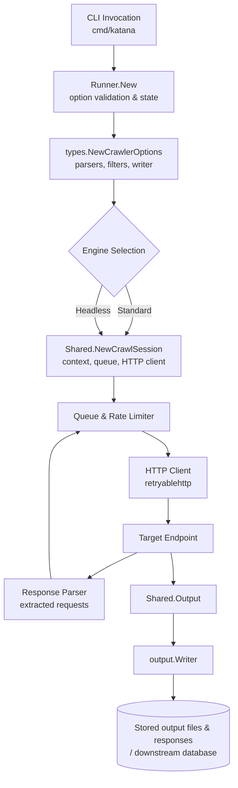

# Request Flow from CLI to Persistence

This document summarizes how Katana processes a crawl request end-to-end, from the moment a user invokes the CLI to the point where crawl artefacts are persisted.

## 1. CLI bootstrap
1. `cmd/katana/main.go` reads CLI flags, handles health checks, and constructs a `runner.Runner`. It also installs signal handlers that persist the in-flight state before exiting and finally invokes `ExecuteCrawling` on the runner.
2. When profiling is requested, a pprof server is started and automatically stopped after crawling.

## 2. Runner wiring
1. `runner.New` validates the supplied options, reloads state when resuming, and builds crawler-wide facilities (e.g., network policies and known file lookups).
2. It delegates to `types.NewCrawlerOptions` to assemble shared components such as:
   * The response parser and scope manager used to decide which URLs are eligible for crawling.
   * Rate limiting, de-duplication filters, and the fast dialer used by HTTP clients.
   * The `output.Writer`, which is responsible for emitting results to STDOUT, JSONL, per-host field files, stored responses, and user callbacks.
3. Based on the headless flag, the runner selects either the standard or hybrid engine implementation.

## 3. Session setup and queueing
1. `common.NewShared` prepares per-run state and, when known-file crawling is enabled, seeds the queue with robots.txt, sitemap.xml, and similar assets.
2. `Shared.NewCrawlSessionWithURL` establishes a cancellable context (optionally time-bound), primes the priority queue with the root request, and constructs a `retryablehttp` client via `BuildHttpClient`. The HTTP client is configured with redirect handling, optional TLS impersonation, proxy support, and a redirect callback that feeds newly discovered requests back into the crawl queue through the parser.

## 4. Concurrent crawl execution
1. `Shared.Do` continuously drains navigation requests from the queue, honours scope and extension filters, enforces concurrency and rate limits, and dispatches work as goroutines.
2. Each goroutine calls the engine-specific `makeRequest`. In the standard engine this method sets request headers, applies user-provided overrides, executes the HTTP call, captures raw request/response payloads, enforces body-size limits, deduplicates content, and enriches the navigation response with parsed HTML, headers, forms, and detected technologies.
3. Successful responses are passed to the parser, which extracts follow-up navigation requests that are enqueued for subsequent processing, closing the crawl loop.

## 5. Output and persistence
1. `Shared.Output` wraps each visited request/response pair (including errors) into an `output.Result` and forwards it to the configured `output.Writer`.
2. `output.StandardWriter` applies match/filter rules, writes coloured or JSON output to STDOUT, appends structured entries to the main output file, emits error logs, and, when enabled, persists HTTP requests/responses and per-host field files within the designated storage directories. These files act as Katana's durable record of crawl results and can feed downstream databases via tooling or the `OnResult` callback.

## Mermaid overview

